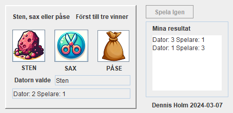

[ENG](#rock-paper-scissors-java-gui) | [SV](#sten-sax-påse-java-gui)

# Rock Paper Scissors (Java GUI)

A classic Rock, Paper, Scissors game built with a graphical interface using Java Swing.

## Features
- Choose between Rock, Paper, or Scissors
- The computer makes a random choice
- First to 3 wins
- Result log updates after each round
- Option to play again after a game ends
- **User interface language: Swedish**

## How to Run
1. Open a terminal in the `src` folder  
2. Compile the code:

   javac inlamningsuppgift04.java

3. Run the program:

   java inlamningsuppgift04

## Notes
- Written as part of a course assignment
- Uses only built-in Java libraries (Swing)

## License
This project is licensed under the MIT License – see the [LICENSE](LICENSE) file for details.

---

# Sten, sax, påse (Java GUI)

Ett klassiskt sten, sax, påse-spel med grafiskt gränssnitt, byggt i Java med Swing.

## Funktioner
- Välj mellan sten, sax eller påse
- Datorn gör ett slumpat val
- Först till 3 vinster vinner matchen
- Resultatlogg uppdateras efter varje omgång
- Möjlighet att spela igen direkt efter avslutad match
- **Gränssnittets språk: Svenska**

## Så här kör du spelet
1. Öppna terminalen i `src`-mappen  
2. Kompilera koden:

   javac inlamningsuppgift04.java

3. Kör programmet:

   java inlamningsuppgift04

## Kommentarer
- Skrivet som del av en kursuppgift
- Använder endast standardbibliotek (Swing)

## Licens
Detta projekt är licensierat under MIT License – se [LICENSE](LICENSE)-filen för detaljer.
